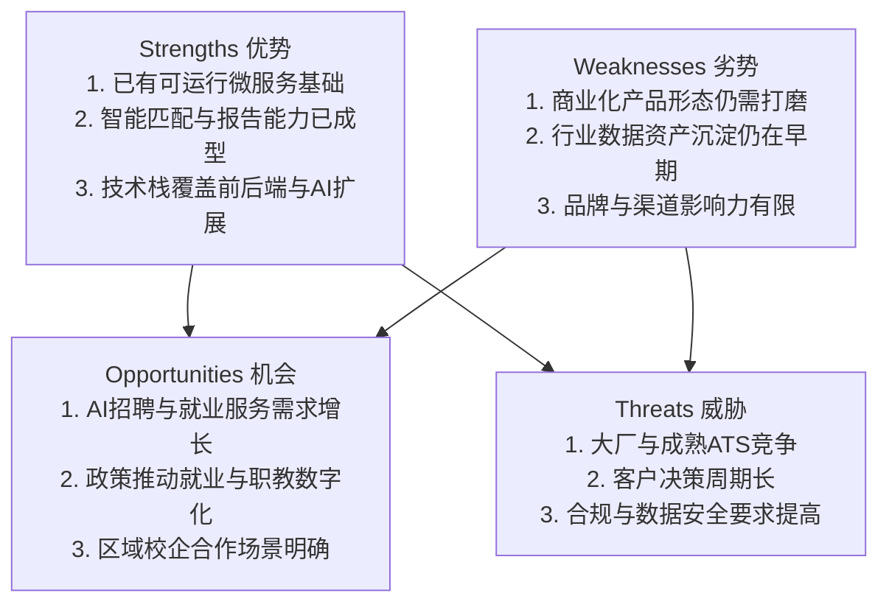
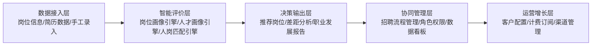
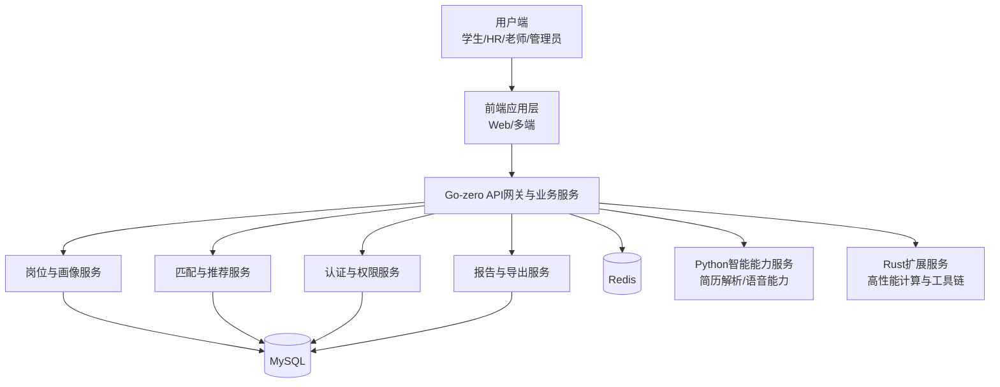
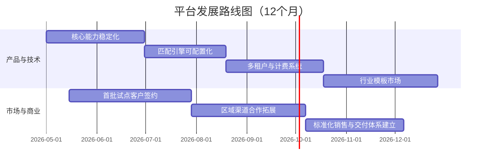

# 《智能岗位评价与一体化招聘管理平台》商业计划书（基础版）

> 版本：V0.1（供编辑）  
> 项目基础：`swordreforge/Job-manner-review-system`  
> 说明：本版本为“板块详细、内容简略”的基础稿；市场与财务相关数据均为预估值。

---

## 摘要（Executive Summary）

“智能岗位评价与一体化招聘管理平台”以 `go-zero + TypeScript 前端 + Python/Rust 扩展服务 + MySQL + Redis` 为技术底座，面向学校、培训机构、中小企业与求职者，提供“岗位建模—人才画像—智能匹配—报告决策—招聘协同”的全流程能力。

平台核心价值：
- 为机构端提升招聘效率（目标提升 30%+）
- 为用人单位降低初筛成本（目标降低 50%）
- 为候选人提供可解释、可执行的能力提升路径
- 为管理层提供可量化的人才决策数据

商业上采用“B2B SaaS 订阅 + B2B2C 渠道合作 + 数据增值服务”三层收入模型，先聚焦教育就业与区域中小企业招聘场景，再向行业通用招聘中台拓展。依托现有仓库已具备的用户认证、岗位管理、画像构建、匹配分析、报告生成和服务编排能力，项目具备较强的技术可行性和商业化落地基础。

---

## 第一章：项目背景与市场机遇

### 1.1 社会背景
- 高校与职业教育端：毕业生规模持续高位，岗位适配压力提升。
- 企业招聘端：岗位要求细化，跨岗位能力迁移评估难。
- 求职者端：信息不对称，简历与岗位匹配反馈滞后。

### 1.2 行业痛点
- 痛点一：岗位标准不统一，评价口径分散。  
- 痛点二：简历筛选高度依赖人工，效率低且主观偏差大。  
- 痛点三：候选人缺乏“差距—行动”闭环反馈。  
- 痛点四：院校与企业之间缺乏统一的数据协同链路。  

### 1.3 市场规模与趋势（数据为预估值）
- 中国智能招聘与人力数字化市场处于持续增长阶段，预计未来 3 年复合增长率 15%~20%。
- 教育就业数字化市场（校企就业服务、职业测评、人才匹配）需求快速释放。
- AI 驱动的人才评估产品从“工具型”向“决策型平台”升级。

### 1.4 目标市场划分
- **核心市场 A**：高校/职业院校就业中心（B2B）
- **核心市场 B**：中小企业人力部门（B2B）
- **拓展市场 C**：区域人力服务机构与培训机构（B2B2C）
- **拓展市场 D**：学生与求职者个人订阅（B2C）

### 1.5 竞品与差异化
- 传统 ATS：流程强、智能弱、解释性不足。
- 单点测评工具：测评强、招聘协同弱。
- 大模型对话工具：生成强、业务结构化弱。

本平台差异化：
- 业务闭环完整：岗位—人才—匹配—报告—行动。
- 结果可解释：多维评分 + 差距分析 + 提升建议。
- 技术可扩展：微服务架构 + 多语言能力组件。

### 1.6 SWOT 分析

---

## 第二章：产品与解决方案

### 2.1 产品设计思路
- 以“岗位能力模型”为核心对象。
- 以“候选人画像”为标准化输入。
- 以“匹配评分 + 差距建议”为决策输出。
- 以“招聘协同流程”为落地抓手。

### 2.2 目标用户与用户旅程
- **院校就业老师**：发布岗位标准 → 批量评估学生 → 输出就业建议。
- **HR/招聘经理**：导入岗位需求 → 筛选候选人 → 形成面试名单。
- **求职者**：上传简历/资料 → 获取匹配结果 → 执行提升计划。

用户旅程（简版）：
1. 信息采集（岗位与人才）
2. 智能评价（匹配与差距）
3. 决策输出（报告与推荐）
4. 行动闭环（学习/训练/复评）

### 2.3 价值主张
- 对企业：更快筛选、减少误判、提升转化。
- 对院校：提高就业指导效率与数据化管理水平。
- 对候选人：获得明确的能力提升路径与岗位建议。

### 2.4 功能架构（基础版）

### 2.5 核心模块清单
- 用户与权限管理（注册、登录、角色）
- 岗位管理与岗位画像生成
- 候选人/学生画像管理（含简历解析）
- 人岗匹配与推荐
- 报告生成与导出
- 后续扩展：面试模拟、招聘流程自动化、行业知识库

---

## 第三章：技术解决方案

### 3.1 架构原则
- 高可用：服务解耦，模块边界清晰。
- 高扩展：能力模块可独立演进。
- 高性能：Go 服务承担核心并发请求。
- 高安全：认证鉴权、数据隔离、接口限流。

### 3.2 当前技术基础（来自仓库）
- 后端：Go + go-zero（API 编排、业务逻辑、中间件）
- 前端：TypeScript + Vite（可持续迭代 UI/交互层）
- AI/算法扩展：Python（语音/模型能力）、Rust（性能与工程化扩展）
- 数据层：MySQL（业务数据）+ Redis（缓存与会话）

### 3.3 系统架构图（基础版）

### 3.4 技术创新点
- 可解释匹配：不是只给“分数”，同时给出“差距项与动作建议”。
- 多语言协同：Go 主干稳定交付，Python/Rust 支撑特定智能能力。
- 模块化 API：便于 SaaS 化、私有化、行业定制三种交付模式并行。

### 3.5 技术里程碑（简版）
- M1：核心 API 稳定化与统一数据字典
- M2：匹配引擎参数化与可配置化
- M3：多租户能力与计费模块上线
- M4：行业模板市场（岗位模型模板）上线

---

## 第四章：商业模式与市场策略

### 4.1 商业模式设计
- **SaaS 订阅费（主收入）**：按机构规模与功能包阶梯定价。
- **实施服务费（次收入）**：部署、培训、流程咨询。
- **增值服务费（增长收入）**：高级报告、行业模型包、API 调用包。

### 4.2 定价策略（数据为预估值）
- 标准版：¥3万~8万/年/机构
- 专业版：¥10万~30万/年/机构
- 企业定制版：¥30万+/年/机构
- B2C 个人版：¥99~399/月

### 4.3 获客与推广策略
- 校企合作试点：以就业中心和区域企业联合试点切入。
- 内容营销：发布“岗位能力白皮书”“就业趋势报告”建立认知。
- 渠道合作：与人力服务机构、培训机构进行分销合作。
- 口碑增长：以“效率提升与成本下降”可量化指标驱动续费。

### 4.4 发展路线图（Roadmap）

---

## 第五章：财务分析与预测

> 注：以下均为预估模型，用于商业决策演示。

### 5.1 成本结构（年度，数据为预估值）
- 人力成本（研发/产品/销售/交付）：¥260万
- 云资源与基础设施：¥45万
- 市场与渠道投入：¥80万
- 行政与合规成本：¥35万
- **总成本：¥420万/年**

### 5.2 收入预测（3年，数据为预估值）

| 年度 | 客户数（机构） | SaaS收入 | 服务与增值收入 | 总收入 |
|---|---:|---:|---:|---:|
| 第1年 | 25 | ¥220万 | ¥80万 | ¥300万 |
| 第2年 | 80 | ¥920万 | ¥260万 | ¥1180万 |
| 第3年 | 180 | ¥2600万 | ¥700万 | ¥3300万 |

### 5.3 盈亏平衡分析（数据为预估值）
- 第1年：亏损（规模投入期）
- 第2年中后期：接近盈亏平衡
- 第3年：进入稳定盈利区间

### 5.4 核心财务指标（数据为预估值）
- 毛利率目标：65%~75%
- 年续费率目标：80%+
- 客户获取成本回收周期（CAC Payback）：12~18个月

---

## 第六章：风险分析与规避

### 6.1 市场风险
- 风险：客户预算收缩、采购周期延长。
- 对策：先签试点、后扩容；采用分层定价降低决策门槛。

### 6.2 技术风险
- 风险：模型效果波动、系统复杂度上升。
- 对策：建立评估基线、灰度发布、可回滚机制。

### 6.3 运营风险
- 风险：交付效率不足导致客户满意度下降。
- 对策：标准化交付包 + 客户成功体系 + SLA 指标管理。

### 6.4 合规风险
- 风险：个人信息与招聘数据处理不当。
- 对策：最小权限、敏感字段加密、审计日志、合规评估流程。

---

## 第七章：团队介绍

### 7.1 团队结构（建议版）
- CEO/业务负责人：商业拓展与战略合作
- CTO：技术架构与研发管理
- 产品总监：产品规划与用户增长
- 交付负责人：客户上线与运营成功
- 财务与法务支持：预算、风控、合规

### 7.2 核心能力
- 具备全栈工程能力（Go/TS/Python/Rust）与 AI 场景落地经验
- 具备教育就业与招聘流程理解能力
- 具备从技术原型到商业化产品的持续迭代能力

### 7.3 组织发展计划
- 0~6个月：研发与产品为主，完成 0→1 标准化交付
- 6~12个月：强化销售与客户成功，形成规模化复制能力
- 12个月后：构建生态合作与行业模板平台

---

## 附录：与仓库能力的映射说明（简版）

- 已有模块：用户认证、岗位管理、岗位图谱、学生画像、匹配计算、职业报告。
- 已有工程基础：go-zero 服务架构、前端工程化、多服务管理脚本、数据库与缓存配置。
- 可商业化延展方向：多租户、计费系统、客户管理后台、企业招聘流程协同、行业模板市场。

---

## 编辑提示

本基础版已覆盖“摘要 + 七大章节 + 必需图表”。你可按比赛/融资场景继续补充：
- 真实市场数据来源（咨询机构报告、公开财报、政策文件）
- 试点客户案例与效果数据
- 团队成员真实履历与顾问阵容
- 融资用途与股权结构（如需）

