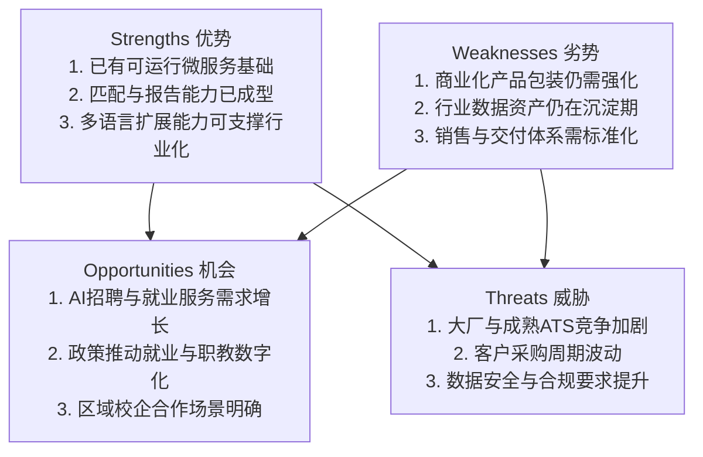
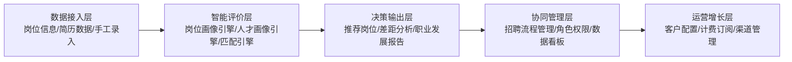
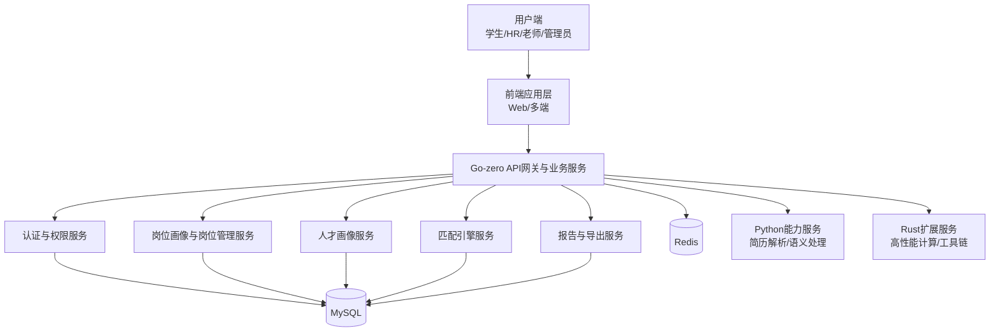
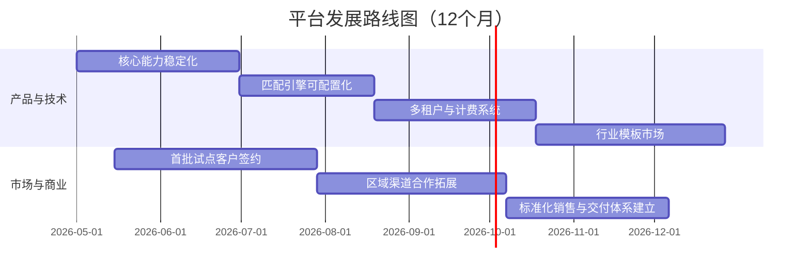

# 《智能岗位评价与一体化招聘管理平台》商业计划书（精修版）

> 版本：V0.2（逐章精修）  
> 项目基础：`swordreforge/Job-manner-review-system`  
> 说明：本版本在基础稿上完成“摘要—七章”口径统一与逻辑精修；市场与财务相关数据均为预估值。

---

## 摘要（Executive Summary）

“智能岗位评价与一体化招聘管理平台”是一套面向院校就业中心、培训机构与中小企业招聘团队的 **人岗匹配决策基础设施**。平台以“**岗位画像—人才画像—匹配引擎—决策报告—行动闭环**”为主链路，把分散的招聘与就业评价流程，沉淀为可复用、可解释、可量化的标准化系统能力。

**一句话定位**：用可解释的 AI 人岗匹配引擎，帮助机构以更低成本、更高确定性完成“招对人、育对人、用对人”。

核心价值与商业闭环：
- **标准化输入**：岗位画像与人才画像统一评价口径，降低主观偏差。
- **智能化决策**：匹配引擎输出多维评分、差距项与建议动作，不止“给分”，还能“给路径”。
- **流程化落地**：从筛选、推荐、评估到复评形成闭环，驱动持续优化。
- **结果化经营**：以效率提升、成本下降、匹配成功率提升为续费与扩容依据。

商业模式采用“**B2B SaaS 订阅 + 实施服务 + 数据/模型增值**”三层结构：先在教育就业与区域中小企业场景完成标准化复制，再向行业化招聘中台延展。依托现有仓库已具备的认证、岗位管理、画像构建、匹配分析、报告生成与服务编排能力，项目具备可落地、可规模化、可持续迭代的基础。

---

## 第一章：项目背景与市场机遇

### 1.1 现状：供需两端同时进入“精细匹配时代”
- 院校端：毕业生规模与就业结构变化并存，就业指导从“信息发布”转向“数据化匹配”。
- 企业端：岗位能力要求持续细化，传统简历筛选难以识别真实胜任力。
- 候选人端：岗位选择增多，但能力差距不透明、改进路径不清晰。

### 1.2 问题：关键环节仍以人工经验驱动
- 岗位描述口径不统一，岗位画像难复用。
- 人才评价维度离散，人才画像难对齐。
- 匹配流程缺少可解释机制，难支撑决策复盘。
- 校企数据链路断点多，协同效率低。

### 1.3 损失：低效与错配造成持续性成本
- 企业：初筛时间长、面试无效比高、试用期错配成本上升。
- 院校：指导覆盖不足、岗位推荐精准度不稳定、就业管理成本高。
- 候选人：重复投递与试错成本高，成长路径缺少反馈闭环。

### 1.4 机会：从“招聘工具”升级到“匹配决策平台”
- AI 与就业数字化政策叠加，推动机构从流程工具采购转向决策能力采购。
- 区域校企合作机制成熟，具备试点验证与规模复制土壤。
- 目标市场具备明确付费主体（院校/企业）与可量化 ROI 指标。

### 1.5 目标市场分层（数据为预估值）
- **A 层（核心）**：高校/职校就业中心（B2B）——需求稳定、复购与扩容潜力高。
- **B 层（核心）**：中小企业 HR 团队（B2B）——痛点集中、决策链短、易验证价值。
- **C 层（增长）**：区域人力服务机构/培训机构（B2B2C）——渠道复制效率高。
- **D 层（补充）**：学生/求职者个人服务（B2C）——增强数据闭环与品牌触达。

### 1.6 竞品对比与差异化
- 传统 ATS：流程管理强，但岗位画像与匹配解释能力弱。
- 单点评测工具：测评能力强，但缺少招聘协同与经营闭环。
- 通用大模型工具：生成能力强，但业务结构化与可追溯性弱。

本平台差异化：
- **统一对象模型**：岗位画像与人才画像贯穿全流程。
- **统一决策核心**：匹配引擎连接筛选、推荐、报告与复评。
- **统一经营指标**：效率、成本、匹配成功率可持续度量。

### 1.7 SWOT 分析（承接后续章节）

---

## 第二章：产品与解决方案

### 2.1 产品目标
构建一套可快速上线、可稳定交付的招聘与就业匹配平台，用统一的岗位画像、人才画像和匹配引擎支持多角色协同决策。

### 2.2 目标用户与价值抓手
- **院校就业老师**：提升批量评估效率与就业指导精度。
- **HR/招聘经理**：缩短筛选周期并降低错配风险。
- **求职者**：获得可执行的能力补齐路径与岗位建议。

### 2.3 用户旅程与关键转化节点
1. **采集建模**：录入岗位信息/简历信息，生成岗位画像与人才画像。  
2. **智能匹配**：匹配引擎输出多维评分、差距项与优先级建议。  
3. **决策协同**：机构端形成推荐名单、面试清单与报告结论。  
4. **行动复评**：候选人执行建议后复评，形成可追踪改进闭环。  

关键转化节点：
- 节点 A：首次成功生成岗位画像（产品激活）。
- 节点 B：首次完成有效匹配报告（价值感知）。
- 节点 C：连续复评带来指标改善（续费与扩容依据）。

### 2.4 MVP 边界（最小可商业化版本）
**MVP 必备能力**：
- 用户与角色权限管理
- 岗位管理与岗位画像生成
- 候选人管理与人才画像生成（含简历解析）
- 匹配引擎评分与差距分析
- 报告生成与导出

**MVP 非必备（后续增强）**：
- 面试模拟
- 招聘流程自动化编排
- 行业知识库与模板市场

### 2.5 功能架构

---

## 第三章：技术解决方案

### 3.1 技术目标
在保持业务响应速度与稳定性的前提下，支持能力模块快速扩展与行业定制交付。

### 3.2 架构原则
- **先进性**：以服务化架构承载 AI 能力演进与功能插件化扩展。
- **稳定性**：核心业务链路解耦，支持限流、熔断、灰度与回滚。
- **扩展性**：按能力边界拆分服务，支持 SaaS 与私有化并行交付。
- **安全性**：认证鉴权、数据分层、审计留痕与敏感信息保护。

### 3.3 当前技术基础（来自仓库）
- 后端：Go + go-zero（API 编排、业务逻辑、中间件）
- 前端：TypeScript + Vite（交互层与可视化承载）
- 智能扩展：Python（解析/模型能力）、Rust（性能与工具链扩展）
- 数据层：MySQL + Redis

### 3.4 系统架构图

### 3.5 “现有能力 → 商业化能力”映射
- 现有认证与权限能力 → 多租户账号体系与机构级隔离。
- 现有岗位/人才管理能力 → 行业模板化配置能力。
- 现有匹配与报告能力 → 标准版/专业版差异化产品包。
- 现有服务编排能力 → 私有化部署与 API 增值服务。

### 3.6 技术里程碑（12 个月）
- M1：统一数据字典与指标体系（保障跨模块一致性）
- M2：匹配引擎参数化与可配置化（支持行业场景）
- M3：多租户与计费能力上线（支撑规模化收费）
- M4：岗位模板市场上线（提升交付效率与扩展性）

---

## 第四章：商业模式与市场策略

### 4.1 收入模型
- **SaaS 订阅费（主收入）**：按机构规模、角色数与功能包计费。
- **实施服务费（次收入）**：部署、培训、流程梳理与上线辅导。
- **增值服务费（增长收入）**：高级报告包、行业模板包、API 调用包。

### 4.2 定价策略（数据为预估值）
- 标准版：¥3万~8万/年/机构
- 专业版：¥10万~30万/年/机构
- 企业定制版：¥30万+/年/机构
- 个人增值版：¥99~399/月

### 4.3 获客路径与转化逻辑
- **试点切入**：区域院校+企业联合试点，先验证匹配效果与效率指标。
- **内容驱动**：输出岗位能力白皮书、就业趋势报告，提高认知与线索质量。
- **渠道复制**：与人力服务机构、培训机构建立分销与联合交付。
- **续费扩容**：用“筛选效率、错配率、推荐转化率”驱动续费和升级。

### 4.4 发展路线图（Roadmap）

---

## 第五章：财务分析与预测

> 注：以下为预估模型，供商业决策与融资沟通使用。

### 5.1 财务假设（口径统一）
- 客户结构以 B2B 机构客户为主，B2C 收入为补充。
- 首年投入以产品打磨、试点交付与市场验证为主。
- 第二年进入渠道化扩张，第三年依赖续费与增购放大收入。

### 5.2 成本结构（年度，数据为预估值）
- 人力成本（研发/产品/销售/交付）：¥260万
- 云资源与基础设施：¥45万
- 市场与渠道投入：¥80万
- 行政与合规成本：¥35万
- **总成本：¥420万/年**

### 5.3 收入预测（3年，数据为预估值）

| 年度 | 客户数（机构） | SaaS收入 | 服务与增值收入 | 总收入 |
|---|---:|---:|---:|---:|
| 第1年 | 25 | ¥220万 | ¥80万 | ¥300万 |
| 第2年 | 80 | ¥920万 | ¥260万 | ¥1180万 |
| 第3年 | 180 | ¥2600万 | ¥700万 | ¥3300万 |

### 5.4 盈亏平衡叙述（与获客节奏对齐）
- 第1年：处于产品验证与客户教育期，亏损可控。
- 第2年：在渠道放量与续费提升驱动下，预计中后期接近盈亏平衡。
- 第3年：进入规模化复制阶段，预计实现稳定盈利。

### 5.5 关键经营指标（数据为预估值）
- 毛利率目标：65%~75%
- 年续费率目标：80%+
- CAC 回收周期：12~18 个月
- 重点跟踪：激活率、报告生成率、匹配转化率、续费扩容率

---

## 第六章：风险分析与规避

### 6.1 风险分级框架
- **高风险**：合规与数据安全风险、核心客户流失风险
- **中风险**：交付效率风险、模型效果波动风险
- **低风险**：单点功能迭代延迟风险

### 6.2 风险与对策闭环
1. **市场风险（中）**  
   风险：预算收缩、采购周期延长。  
   对策：试点先行+分层定价+阶段验收，降低一次性决策压力。

2. **技术风险（中）**  
   风险：模型效果波动、链路复杂度上升。  
   对策：建立评估基线、灰度发布、回滚机制与监控告警。

3. **运营风险（中）**  
   风险：交付质量不稳定影响口碑。  
   对策：标准交付包、客户成功机制、SLA 与复盘制度。

4. **合规风险（高）**  
   风险：个人信息与招聘数据处理不当。  
   对策：最小权限、敏感字段加密、审计日志、合规审查流程。

---

## 第七章：团队介绍

### 7.1 团队组织与分工
- CEO/业务负责人：战略合作与商业拓展
- CTO：平台架构与研发体系
- 产品负责人：需求管理、版本规划与用户增长
- 交付负责人：实施上线、客户成功与续费经营
- 财务/法务支持：预算管理、合同风控与合规治理

### 7.2 能力与执行路径对齐
- **技术能力**（Go/TS/Python/Rust）→ 支撑产品稳定交付与能力扩展。
- **行业理解**（就业与招聘流程）→ 支撑场景适配与方案落地。
- **产品化能力**（从原型到标准化）→ 支撑规模复制与成本优化。

### 7.3 阶段性组织目标
- 0~6个月：完成 MVP 打磨与试点交付闭环。
- 6~12个月：完善销售-交付-成功协同，形成标准化复制。
- 12个月后：强化生态合作，推进行业模板市场与区域扩张。

---

## 附录：与仓库能力的映射说明（精修版）

- 已有能力：用户认证、岗位管理、岗位图谱、学生画像、人岗匹配、职业报告。
- 已有工程基础：go-zero 服务架构、前端工程化、多服务脚本、MySQL/Redis 配置。
- 商业化延展：多租户、计费系统、客户管理后台、企业招聘协同、行业模板市场。

---

## 编辑提示

下一轮可继续补充：
- 真实市场数据来源与引用口径
- 试点客户案例与量化效果
- 团队成员履历与顾问阵容
- 融资用途、里程碑与资金使用计划
